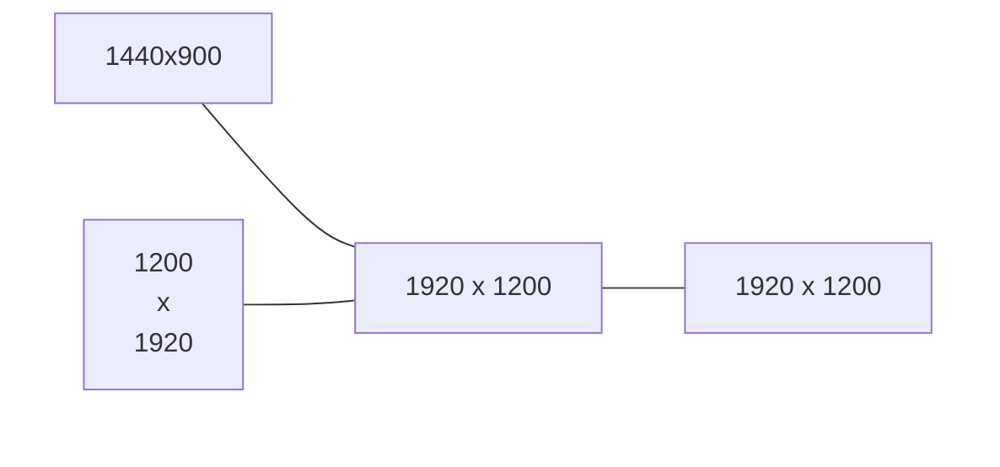
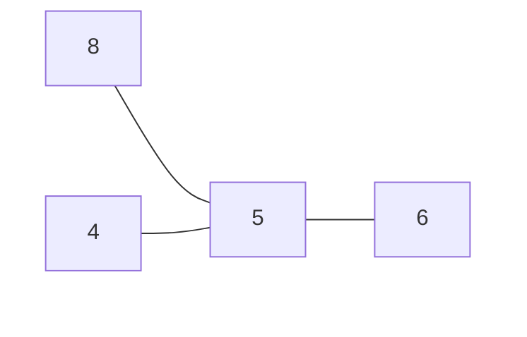

# Zwei's DWM Fork

> DWM for those who like odd monitor configurations

Let's say that you had the bad taste to create a monitor configuration as follows:



Under normal circumstances, you'll have to furiously toggle `,` and `.` to get to the right monitor. However, if you're already in such a predicament, it's highly likely you have the good fortune to possess a numpad. Wouldn't it be great if you could map your monitor to something along the following lines:



Well now you can!

## Own Patches

All patches can be found in the `./patches` folder.

### focustagtomon

```
Adds in focusmonnum and tagmonnum methods which are the equivalent of
focusmon and tagmon but accept an interger monitor number to use rather
than just a direction.

Can be called in config as follows:
MODKEY, XK_KP_Left,  focusmonnum, {.i = 2 }
MODKEY, XK_KP_Begin, tagmonnum,   {.i = 3 }

Very useful for multi-monitor setups with strange configurations such as
4 monitors laid out 3 in one row and one on top in the middle.
```

### centermousetomon

Requires above focustagtomon.

```
Call with monitor number to move mouse to center of that monitor.

Ex:
{ MODKEY|ControlMask, XK_KP_Left,  centermousetomonnum, {.i = 2 } },
```

Useful in combination with [keynav](https://github.com/Zweihander-Main/keynav) to allow for keynav multi-monitor moving. Example in `keynavrc`:

```
KP_Begin sh "sleep 0.1; xdotool key 'Super+Control+KP_Begin' 'Super+semicolon'", end
KP_Up sh "sleep 0.1; xdotool key 'Super+Control+KP_Up' 'Super+semicolon'", end
KP_Left sh "sleep 0.1; xdotool key 'Super+Control+KP_Left' 'Super+semicolon'", end
KP_Right sh "sleep 0.1; xdotool key 'Super+Control+KP_Right' 'Super+semicolon'", end
```

## Other Patches

- [activetagindicatorbar](https://dwm.suckless.org/patches/activetagindicatorbar/) - changes active rectangle to bar
- [centeredwindowname](https://dwm.suckless.org/patches/centeredwindowname/) - centers window name in statusbar
- [colorbar](https://dwm.suckless.org/patches/colorbar/) - increases color customization of statusbar
- [floatrules](https://dwm.suckless.org/patches/floatrules/) - more float rule customization
- [noborderfloatingfix](https://dwm.suckless.org/patches/noborder/) - removes border when only one window visible

## Available for Hire

I'm available for freelance, contracts, and consulting both remotely and in the Hudson Valley, NY (USA) area. [Some more about me](https://www.zweisolutions.com/about.html) and [what I can do for you](https://www.zweisolutions.com/services.html).

Feel free to drop me a message at:

```
hi [a+] zweisolutions {●} com
```
